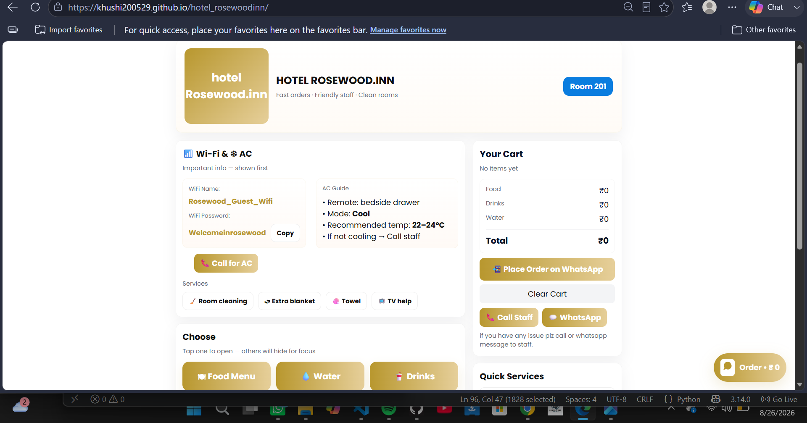
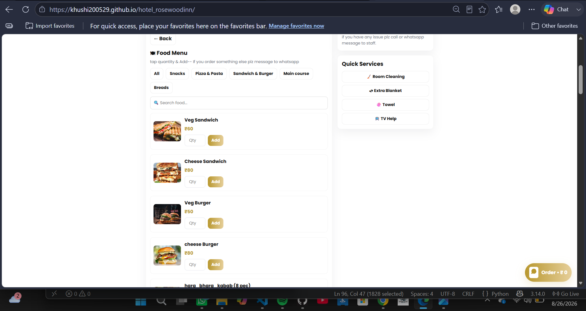
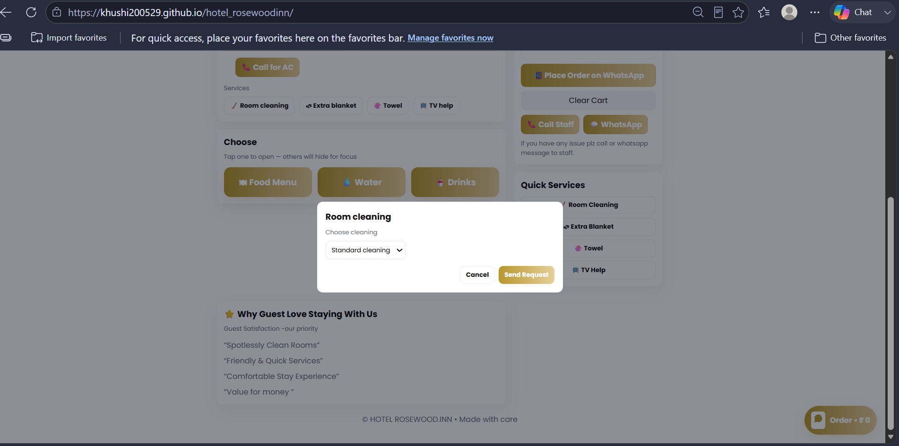
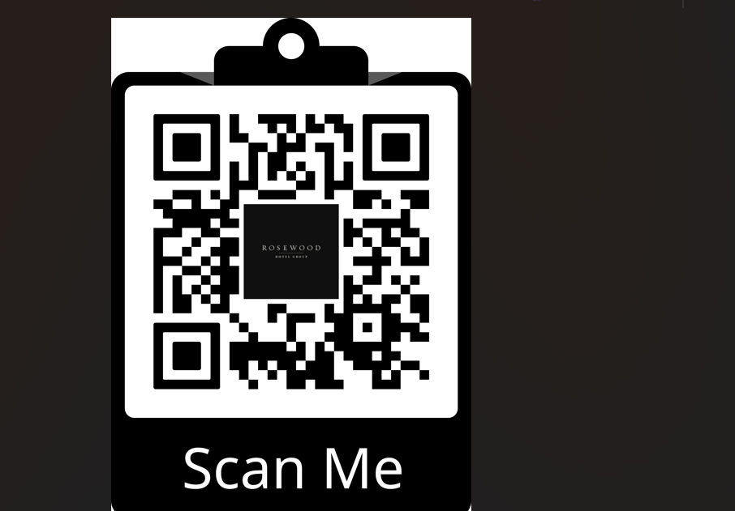

# 🏨 Hotel Rosewood.inn — Digital Guest Service System

A modern **hotel guest-service and food-ordering web application** designed to make the guest experience faster, simpler, and more convenient.

The system provides guests with a digital interface where they can access hotel information, browse food and beverages, place orders, request room services, and contact hotel staff through **Call** and **WhatsApp** options.

🔗 **Live Website:** https://khushi200529.github.io/hotel_rosewoodinn/

---

## ✨ Key Features

### 🏨 Guest Dashboard
A clean and user-friendly dashboard designed specifically for hotel guests.

- Hotel and room information
- Guest Wi-Fi details
- AC usage guide
- Quick access to hotel services
- Food, water, and drinks sections
- Shopping cart with order total

### 🍔 Digital Food Menu

Guests can browse the available food items through a digital menu.

- Food categories
- Food item images
- Prices
- Search functionality
- Quantity selection
- Add-to-cart functionality

### 🛎️ Room Service

Guests can request hotel services directly from the application.

Available services include:

- 🧹 Room Cleaning
- 🛏️ Extra Blanket
- 🧻 Towel
- 📺 TV Help
- ❄️ AC Assistance

### 🛒 Cart & Ordering

The application provides a simple cart system for managing orders.

- Add food/drinks/water
- Select quantities
- View item totals
- View overall order total
- Clear cart
- Place order through WhatsApp

### 📞 Contact Hotel Staff

Guests can quickly contact hotel staff using:

- Call Staff
- WhatsApp
- Call for AC assistance

### 📱 QR-Code Based Guest Access

A QR-code system is included to provide guests with quick access to the digital hotel service interface.

Guests can scan the QR code using their mobile device instead of manually entering the website address.

---

## 📸 Project Screenshots

### 🏨 Hotel Guest Dashboard



### 🍔 Digital Food Menu



### 🧹 Room Service Request



### 📱 QR-Code Access System



---

## 🧩 How the System Works

```text
Guest
  │
  ▼
Scan QR Code / Open Website
  │
  ▼
Hotel Guest Dashboard
  │
  ├── Wi-Fi & AC Information
  │
  ├── Food Menu
  │      └── Add Items → Cart
  │
  ├── Water & Drinks
  │      └── Add Items → Cart
  │
  ├── Room Services
  │      ├── Room Cleaning
  │      ├── Extra Blanket
  │      ├── Towel
  │      └── TV Help
  │
  └── Call / WhatsApp Staff
             │
             ▼
        Guest Request / Order
```

---

## 🛠️ Technologies Used

- **HTML5** — Web page structure
- **CSS3** — Styling and responsive user interface
- **JavaScript** — Interactions, cart, services and ordering logic
- **GitHub Pages** — Website deployment
- **QR Code** — Quick guest access
- **WhatsApp Integration** — Guest order/contact flow

---

## 📁 Project Structure

```text
hotel_rosewoodinn/
│
├── index.html
├── image/
│
├── hotel-home.png
├── food-menu.png
├── service-request.png
├── qr-code.png
│
└── README.md
```

---

## 🚀 How to Run Locally

### 1. Clone the repository

```bash
git clone https://github.com/khushi200529/hotel_rosewoodinn.git
```

### 2. Open the project folder

```bash
cd hotel_rosewoodinn
```

### 3. Run the project

Since this is a frontend web application, you can open `index.html` directly in a browser.

For a better local development experience, use **VS Code Live Server** or any local HTTP server.

---

## 🌐 Deployment

The project is deployed using **GitHub Pages**.

🔗 **Live Demo:**  
https://khushi200529.github.io/hotel_rosewoodinn/

---

## 🎯 Project Objective

The objective of this project is to create a **digital hotel guest-service system** that reduces the need for manual requests and provides guests with a convenient way to:

- Access hotel information
- Browse food and beverages
- Place orders
- Request room services
- Contact hotel staff
- Access the service portal using a QR code

---

## 💡 Highlights

⭐ Digital hotel guest dashboard  
⭐ QR-code based access  
⭐ Food ordering system  
⭐ Shopping cart  
⭐ Room-service request system  
⭐ WhatsApp ordering  
⭐ Call staff functionality  
⭐ Wi-Fi & AC information  
⭐ Responsive and user-friendly interface  
⭐ Deployed using GitHub Pages  

---

## 🔮 Future Improvements

Some possible future improvements include:

- Online payment integration
- Guest login/authentication
- Admin dashboard
- Real-time order tracking
- Database integration
- Order history
- Room-status management
- Push notifications for staff
- Multi-language support
- Mobile application version

---

## 👩‍💻 Author

**Khushi Shekhawat**

GitHub: [@khushi200529](https://github.com/khushi200529)

---

## 📌 Disclaimer

This project is developed for **educational, portfolio, and demonstration purposes**.

